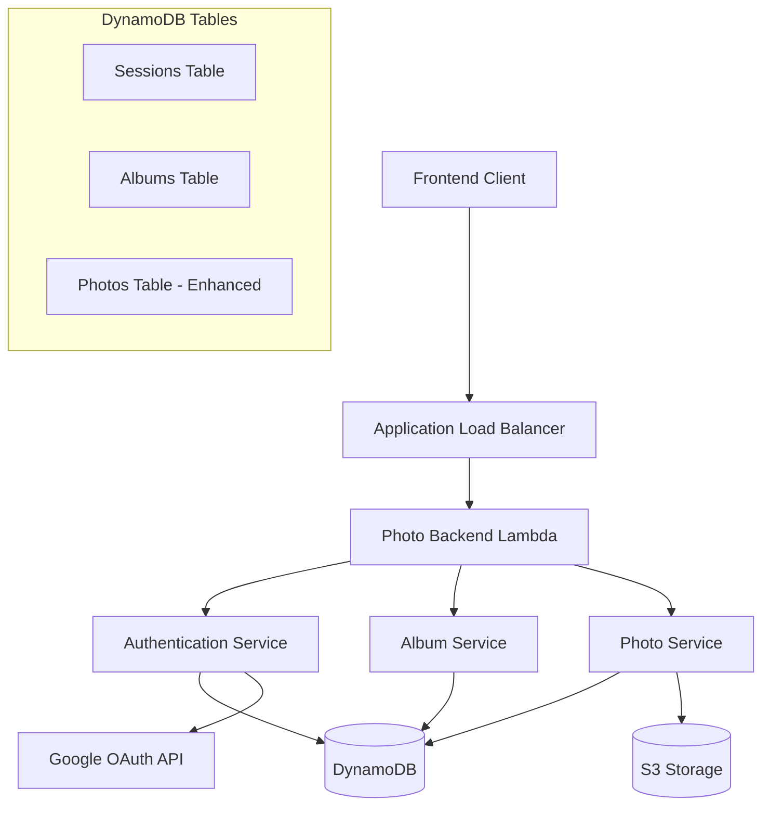
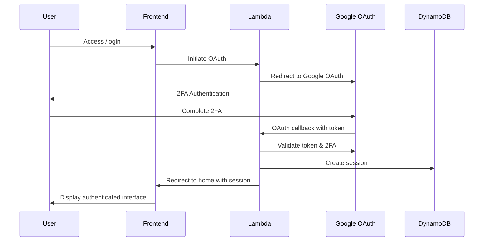

# Design Document

## Overview

This design document outlines the architecture for enhancing the existing photo backend system with Google OAuth 2FA authentication and album-based photo organization. The system will restrict access to a single authorized user (lanctotsm@gmail.com) and organize photos into named albums with adaptive display capabilities.

## Architecture

### High-Level Architecture



### Authentication Flow



## Components and Interfaces

### 1. Authentication Service

**Purpose**: Handle Google OAuth 2FA authentication and session management

**Key Methods**:
- `ValidateGoogleToken(token string) (*UserInfo, error)`
- `CreateSession(userEmail string) (*Session, error)`
- `ValidateSession(sessionToken string) (*Session, error)`
- `ExpireSession(sessionToken string) error`

**Dependencies**: Google OAuth API, DynamoDB Sessions table

### 2. Album Service

**Purpose**: Manage album creation, listing, and metadata

**Key Methods**:
- `CreateAlbum(name string, userID string) (*Album, error)`
- `ListAlbums(userID string) ([]*Album, error)`
- `GetAlbum(albumID string, userID string) (*Album, error)`
- `SetAlbumThumbnail(albumID string, photoID string) error`
- `DeleteAlbum(albumID string, userID string) error`

**Dependencies**: DynamoDB Albums table

### 3. Enhanced Photo Service

**Purpose**: Handle photo uploads with album association

**Key Methods**:
- `UploadPhoto(req *UploadRequest, albumID string) (*PhotoMetadata, error)`
- `ListPhotosByAlbum(albumID string) ([]*PhotoMetadata, error)`
- `GetPhoto(photoID string) (*PhotoMetadata, error)`
- `DeletePhoto(photoID string) error`

**Dependencies**: S3 Storage, DynamoDB Photos table, Image Processor

### 4. Session Middleware

**Purpose**: Validate authentication for protected endpoints

**Key Methods**:
- `RequireAuth(handler HandlerFunc) HandlerFunc`
- `GetUserFromSession(sessionToken string) (*User, error)`

## Data Models

### Sessions Table

```go
type Session struct {
    SessionToken string    `json:"session_token" dynamodbav:"session_token"`
    UserEmail    string    `json:"user_email" dynamodbav:"user_email"`
    CreatedAt    time.Time `json:"created_at" dynamodbav:"created_at"`
    ExpiresAt    time.Time `json:"expires_at" dynamodbav:"expires_at"`
    LastActivity time.Time `json:"last_activity" dynamodbav:"last_activity"`
}
```

**Primary Key**: `session_token`
**GSI**: `user_email-created_at-index`
**TTL**: `expires_at`

### Albums Table

```go
type Album struct {
    AlbumID      string    `json:"album_id" dynamodbav:"album_id"`
    UserEmail    string    `json:"user_email" dynamodbav:"user_email"`
    Name         string    `json:"name" dynamodbav:"name"`
    ThumbnailID  string    `json:"thumbnail_id,omitempty" dynamodbav:"thumbnail_id,omitempty"`
    PhotoCount   int       `json:"photo_count" dynamodbav:"photo_count"`
    CreatedAt    time.Time `json:"created_at" dynamodbav:"created_at"`
    UpdatedAt    time.Time `json:"updated_at" dynamodbav:"updated_at"`
}
```

**Primary Key**: `album_id`
**GSI**: `user_email-created_at-index`

### Enhanced Photos Table

```go
type PhotoMetadata struct {
    ID           string    `json:"id" dynamodbav:"id"`
    AlbumID      string    `json:"album_id" dynamodbav:"album_id"`
    UserEmail    string    `json:"user_email" dynamodbav:"user_email"`
    OriginalKey  string    `json:"original_key" dynamodbav:"original_key"`
    MediumKey    string    `json:"medium_key" dynamodbav:"medium_key"`
    ThumbnailKey string    `json:"thumbnail_key" dynamodbav:"thumbnail_key"`
    Title        string    `json:"title,omitempty" dynamodbav:"title,omitempty"`
    Description  string    `json:"description,omitempty" dynamodbav:"description,omitempty"`
    Tags         []string  `json:"tags,omitempty" dynamodbav:"tags,omitempty"`
    UploadedAt   time.Time `json:"uploaded_at" dynamodbav:"uploaded_at"`
    FileSize     int64     `json:"file_size" dynamodbav:"file_size"`
    Width        int       `json:"width" dynamodbav:"width"`
    Height       int       `json:"height" dynamodbav:"height"`
    ContentType  string    `json:"content_type" dynamodbav:"content_type"`
}
```

**Primary Key**: `id`
**GSI**: `album_id-uploaded_at-index`
**GSI**: `user_email-uploaded_at-index`

## API Endpoints

### Authentication Endpoints

```
POST /auth/login
- Initiates Google OAuth flow
- Returns: OAuth redirect URL

GET /auth/callback
- Handles OAuth callback
- Validates 2FA completion
- Creates session
- Redirects to home

POST /auth/logout
- Expires current session
- Returns: Success confirmation

GET /auth/status
- Returns current authentication status
- Returns: User info if authenticated
```

### Album Endpoints

```
POST /albums
- Creates new album
- Requires: Authentication
- Body: { "name": "Album Name" }
- Returns: Album metadata

GET /albums
- Lists user's albums
- Requires: Authentication
- Returns: Array of albums with thumbnails

GET /albums/{albumId}
- Gets specific album details
- Requires: Authentication
- Returns: Album metadata

PUT /albums/{albumId}/thumbnail
- Sets album thumbnail
- Requires: Authentication
- Body: { "photo_id": "photo-uuid" }
- Returns: Updated album

DELETE /albums/{albumId}
- Deletes album and all photos
- Requires: Authentication
- Returns: Success confirmation
```

### Enhanced Photo Endpoints

```
POST /albums/{albumId}/photos
- Uploads photo to specific album
- Requires: Authentication
- Body: { "imageData": "base64", "contentType": "image/jpeg", ... }
- Returns: Photo metadata

GET /albums/{albumId}/photos
- Lists photos in album
- Requires: Authentication
- Query params: ?page=1&limit=20
- Returns: Paginated photo list

GET /photos/{photoId}
- Gets specific photo metadata
- Requires: Authentication
- Returns: Photo metadata

DELETE /photos/{photoId}
- Deletes photo
- Requires: Authentication
- Returns: Success confirmation
```

## Error Handling

### Authentication Errors

- **401 Unauthorized**: Invalid or expired session
- **403 Forbidden**: Valid session but wrong user email
- **404 Not Found**: Unauthenticated access to protected pages

### Album Errors

- **400 Bad Request**: Invalid album name or missing required fields
- **404 Not Found**: Album not found or doesn't belong to user
- **409 Conflict**: Album operation conflicts (e.g., deleting non-empty album)

### Photo Errors

- **400 Bad Request**: Invalid image data or unsupported format
- **413 Payload Too Large**: Image exceeds size limits
- **422 Unprocessable Entity**: Image processing failures

### Session Management

- **Session Expiry**: 24 hours of inactivity
- **Session Cleanup**: Automated cleanup of expired sessions via DynamoDB TTL
- **Concurrent Sessions**: Allow multiple active sessions per user

## Testing Strategy

### Unit Tests

1. **Authentication Service Tests**
   - Google token validation
   - Session creation and validation
   - Session expiry handling

2. **Album Service Tests**
   - Album CRUD operations
   - Thumbnail management
   - User isolation

3. **Photo Service Tests**
   - Album-associated uploads
   - Photo listing by album
   - Metadata management

### Integration Tests

1. **Authentication Flow Tests**
   - Complete OAuth flow simulation
   - Session persistence across requests
   - Protected endpoint access

2. **Album Management Tests**
   - End-to-end album creation
   - Photo upload to albums
   - Album deletion with cleanup

3. **API Endpoint Tests**
   - All endpoint combinations
   - Error response validation
   - CORS handling

### Security Tests

1. **Authentication Security**
   - Session token entropy validation
   - Session hijacking prevention
   - 2FA requirement verification

2. **Authorization Tests**
   - User isolation verification
   - Protected endpoint access control
   - Cross-user data access prevention

## Implementation Considerations

### Migration Strategy

1. **Database Schema Updates**
   - Add Sessions table
   - Add Albums table
   - Enhance Photos table with album_id and user_email
   - Create necessary GSIs

2. **Backward Compatibility**
   - Maintain existing photo endpoints during transition
   - Migrate existing photos to default album
   - Gradual rollout of authentication requirements

### Performance Optimizations

1. **Database Queries**
   - Use GSIs for efficient album and photo listing
   - Implement pagination for large photo collections
   - Cache frequently accessed album metadata

2. **Image Processing**
   - Maintain existing image processing pipeline
   - Consider lazy thumbnail generation for albums
   - Optimize S3 key structure for album organization

### Security Considerations

1. **Session Management**
   - Use cryptographically secure random tokens
   - Implement proper session rotation
   - Store session data securely in DynamoDB

2. **API Security**
   - Validate all input parameters
   - Implement rate limiting
   - Use HTTPS for all communications
   - Sanitize user-provided album names