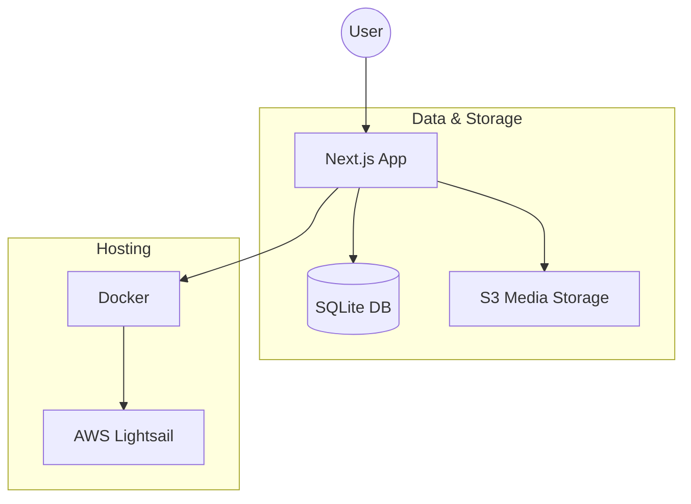

# Heron CMS

Heron is a modern, lightweight, and containerized CMS built for personal portfolios and blogs. It features a Next.js frontend, a SQLite database managed via Drizzle ORM, and integrated media management using S3-compatible storage.

## 🚀 Key Features

- **Content Management**: Full support for creating, editing, and deleting blog posts and photo albums.
- **Media Library**: Integrated image management with direct S3/MinIO uploads, automatic metadata tracking (dimensions, captions), and public URL generation.
- **Admin Dashboard**: A secure management interface (`/admin`) for site statistics and content control.
- **Authentication**: Powered by NextAuth.js, supporting Google OAuth for production and a local bypass for development.
- **Portable Data**: Uses SQLite for the main database, making the entire application easy to back up and move.
- **Infrastructure as Code**: Includes AWS CloudFormation templates for one-click deployment to AWS Lightsail.
- **Dockerized Workflow**: Seamless development and production environments using Docker and Docker Compose.

## 📊 Project Architecture



## 📂 Project Layout

```text
/
├── heron/                  # Main Next.js 14 application
│   ├── app/                # App Router: Pages, Layouts, and API Routes
│   │   ├── admin/          # Management dashboard and tools
│   │   ├── api/            # Backend API endpoints (REST)
│   │   └── (public)/       # Public pages (Posts, Albums, Resume)
│   ├── components/         # Reusable React components
│   ├── drizzle/            # SQL migration files generated by Drizzle
│   ├── lib/                # Shared logic (DB schema, S3 client, Auth options)
│   ├── scripts/            # Database seeding and maintenance scripts
│   └── public/             # Static assets (Robots.txt, icons)
├── infra/                  # AWS CloudFormation templates for Lightsail
├── .github/                # CI/CD Workflows (Deployments)
├── .cursor/                # Project-specific AI rules and instructions
├── docker-compose.yml      # Production orchestration (App + Volumes)
└── docker-compose.dev.yml  # Local development (App + MinIO for local S3)
```

## 🛠 Technology Stack

- **Framework**: [Next.js 14](https://nextjs.org/) (App Router)
- **Language**: [TypeScript](https://www.typescriptlang.org/)
- **Database**: [SQLite](https://sqlite.org/) via [better-sqlite3](https://github.com/WiseLibs/better-sqlite3)
- **ORM**: [Drizzle ORM](https://orm.drizzle.team/)
- **Auth**: [NextAuth.js](https://next-auth.js.org/)
- **Storage**: S3-compatible ([AWS S3](https://aws.amazon.com/s3/) / [MinIO](https://min.io/))
- **Deployment**: [Docker](https://www.docker.com/) & [AWS Lightsail](https://aws.amazon.com/lightsail/)

## 💻 Getting Started

### Local Development

1. **Environment**: Copy `.env.example` to `.env` in the root and fill in your credentials.
2. **Start Services**:
   ```bash
   docker compose -f docker-compose.dev.yml up --build
   ```
3. **Seed Data**: Initialize your local database with a starter album:
   ```bash
   docker compose exec heron npm run seed:local
   ```
4. **Access**:
   - Web App: `http://localhost:3000`
   - MinIO Console: `http://localhost:9001` (login with `minioadmin`/`minioadmin`)

## 🚢 Deployment

Deployments are automated via GitHub Actions to AWS Lightsail. The pipeline builds the Docker image, pushes it to GHCR, and updates the Lightsail instance using CloudFormation.

See `.github/workflows/deploy-lightsail.yml` for the CI/CD pipeline and `infra/lightsail-cms.yaml` for the infrastructure definition.
