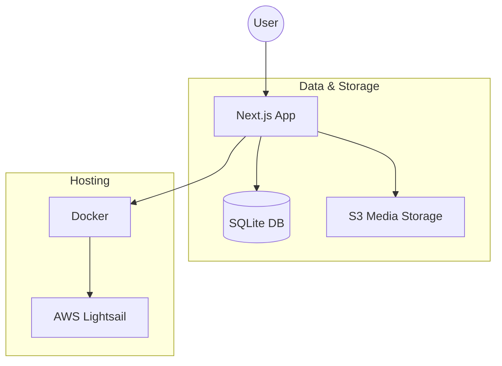

# Heron CMS

Heron is a modern, lightweight, and containerized CMS built for personal portfolios and blogs. It features a Next.js frontend, a SQLite database managed via Drizzle ORM, and integrated media management using S3-compatible storage.

## 🚀 Key Features

- **Content Management**: Full support for creating, editing, and deleting blog posts and photo albums.
- **Media Library**: Integrated image management with direct S3/MinIO uploads, automatic metadata tracking (dimensions, captions), and public URL generation.
- **Admin Dashboard**: A secure management interface (`/admin`) for site statistics and content control. Drag-and-drop reordering for album images at `/admin/albums/[id]/images`.
- **Authentication**: Powered by NextAuth.js, supporting Google OAuth for production and a local bypass for development.
- **Portable Data**: Uses SQLite for the main database, making the entire application easy to back up and move.
- **Infrastructure as Code**: Includes AWS CloudFormation templates for one-click deployment to AWS Lightsail.
- **Dockerized Workflow**: Seamless development and production environments using Docker and Docker Compose.

### UI & UX

- **Tailwind CSS v4**: Utility-first styling with a warm, custom theme (chestnut, olive, desert-tan, caramel).
- **Dark Mode**: Class-based dark theme with a nav toggle; respects `prefers-color-scheme` and persists choice in `localStorage`.
- **Toasts**: In-app notifications (success, error, confirmations) via [sonner](https://sonner.emilkowal.ski/) instead of browser alerts.
- **Skeleton Loaders**: Loading states for the dashboard, media library, posts list, and albums grid.
- **Full-Text Search**: SQLite FTS5 over posts and albums; debounced search bar in the nav with dropdown results.
- **RSS & Sitemap**: `/feed.xml` (RSS 2.0 from published posts), `/sitemap.xml`, and `robots.txt` for SEO and syndication.

## 📊 Project Architecture



## 📂 Project Layout

```text
/
├── heron/                  # Main Next.js 14 application
│   ├── app/                # App Router: Pages, Layouts, and API Routes
│   │   ├── admin/          # Management dashboard and tools (posts, albums, media, album image order)
│   │   ├── api/            # Backend API (REST + search, albums/[albumID]/images for reorder)
│   │   ├── feed.xml/       # RSS 2.0 feed (published posts)
│   │   ├── sitemap.ts      # Dynamic sitemap.xml
│   │   ├── robots.ts       # robots.txt
│   │   └── (public)/       # Public pages (Posts, Albums, Resume, Upload)
│   ├── components/         # Reusable React (Navigation, SearchBar, ThemeToggle, SortableImageGrid, Skeleton, etc.)
│   ├── drizzle/            # SQL migrations (schema + FTS5 search tables)
│   ├── lib/                # Shared logic (DB schema, S3 client, Auth, serializers)
│   ├── services/           # Business logic (posts, albums, images, albumImages, search)
│   ├── scripts/            # Database seeding and maintenance scripts
│   └── public/             # Static assets
├── infra/                  # AWS CloudFormation templates for Lightsail
├── .github/                # CI/CD Workflows (Deployments)
├── .cursor/                # Project-specific AI rules and instructions
├── docker-compose.yml      # Production orchestration (App + Volumes)
└── docker-compose.dev.yml  # Local development (App + MinIO for local S3)
```

## 🛠 Technology Stack

- **Framework**: [Next.js 14](https://nextjs.org/) (App Router)
- **Language**: [TypeScript](https://www.typescriptlang.org/)
- **Styling**: [Tailwind CSS v4](https://tailwindcss.com/) with PostCSS
- **Database**: [SQLite](https://sqlite.org/) via [better-sqlite3](https://github.com/WiseLibs/better-sqlite3) (including FTS5 for search)
- **ORM**: [Drizzle ORM](https://orm.drizzle.team/)
- **Auth**: [NextAuth.js](https://next-auth.js.org/)
- **Storage**: S3-compatible ([AWS S3](https://aws.amazon.com/s3/) / [MinIO](https://min.io/))
- **UI**: [sonner](https://sonner.emilkowal.ski/) (toasts), [@dnd-kit](https://dndkit.com/) (drag-and-drop)
- **Deployment**: [Docker](https://www.docker.com/) & [AWS Lightsail](https://aws.amazon.com/lightsail/)

## 💻 Getting Started

### Local Development

1. **Environment**: Copy `.env.example` to `.env` in the root and fill in your credentials.
2. **Start Services**:
   ```bash
   docker compose -f docker-compose.dev.yml up --build
   ```
3. **Seed Data**: Initialize your local database with a starter album:
   ```bash
   docker compose exec heron npm run seed:local
   ```
4. **Access**:
   - Web App: `http://localhost:3000`
   - MinIO Console: `http://localhost:9001` (login with `minioadmin`/`minioadmin`)

### Commands (from `heron/`)

| Command        | Description              |
|----------------|--------------------------|
| `npm run dev`  | Start Next.js dev server |
| `npm run build`| Production build         |
| `npm run lint` | Run ESLint               |
| `npm run typecheck` | TypeScript check    |
| `npm run seed:local` | Seed local DB      |

## 🚢 Deployment

Deployments are automated via GitHub Actions to AWS Lightsail. The pipeline builds the Docker image, pushes it to GHCR, and updates the Lightsail instance using CloudFormation.

See `.github/workflows/deploy-lightsail.yml` for the CI/CD pipeline and `infra/lightsail-cms.yaml` for the infrastructure definition.
