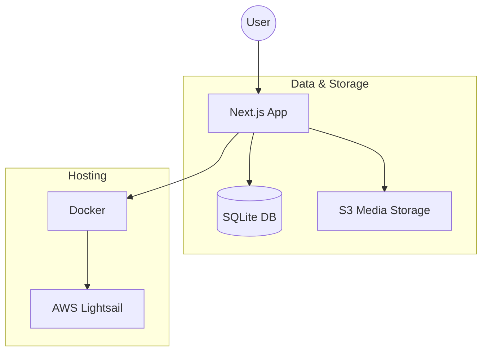

# Heron CMS

Heron is a modern, lightweight, and containerized CMS built for personal portfolios and blogs. It features a Next.js frontend, a SQLite database managed via Drizzle ORM, and integrated media management using S3-compatible storage.

## 🚀 Key Features

- **Content Management**: Full support for creating, editing, and deleting blog posts and photo albums.
- **Media Library**: Integrated image management with direct S3/MinIO uploads, automatic metadata tracking (dimensions, captions), and public URL generation.
- **Admin Dashboard**: A secure management interface (`/admin`) for site statistics and content control.
- **Authentication**: Powered by NextAuth.js, supporting Google OAuth for production and a local bypass for development.
- **Portable Data**: Uses SQLite for the main database, making the entire application easy to back up and move.
- **Infrastructure as Code**: Includes AWS CloudFormation templates for one-click deployment to AWS Lightsail.
- **Dockerized Workflow**: Seamless development and production environments using Docker and Docker Compose.

## 📊 Project Architecture


```mermaid
graph TD
    User((User)) --> NextJS[Next.js App]
    
    subgraph "Data & Storage"
        NextJS --> SQLite[(SQLite DB)]
        NextJS --> S3[S3 Media Storage]
    end
    
    subgraph Hosting
        NextJS --> Docker[Docker]
        Docker --> Lightsail[AWS Lightsail]
    end
```

## 📂 Project Layout

```text
/
├── heron/                  # Main Next.js application
│   ├── app/                # App Router: Pages, Layouts, and API Routes
│   │   ├── admin/          # Management dashboard and tools
│   │   ├── api/            # Backend API endpoints (REST)
│   │   └── (public)/       # Public pages (Posts, Albums, Resume)
│   ├── components/         # Reusable React components
│   ├── actions/            # UI/business actions (multi-step operations)
│   ├── drizzle/            # SQL migration files generated by Drizzle
│   ├── lib/                # Library setup (ORM, auth, storage, helpers)
│   ├── services/           # Data access layer (DB queries)
│   ├── scripts/            # Database seeding and maintenance scripts
│   └── public/             # Static assets (Robots.txt, icons)
├── infra/                  # AWS CloudFormation templates for Lightsail
├── .github/                # CI/CD Workflows (Deployments)
├── .cursor/                # Project-specific AI rules and instructions
├── docker-compose.yml      # Production orchestration (App + Volumes)
└── docker-compose.dev.yml  # Local development (App + MinIO for local S3)
```

## 🛠 Technology Stack

- **Framework**: [Next.js 15](https://nextjs.org/) (App Router)
- **Runtime**: Node.js 22+ locally; CI and deployment use Node 24 to match the Lightsail/Bitnami runtime (required for native better-sqlite3).
- **Language**: [TypeScript](https://www.typescriptlang.org/)
- **Database**: [SQLite](https://sqlite.org/) via [better-sqlite3](https://github.com/WiseLibs/better-sqlite3)
- **ORM**: [Drizzle ORM](https://orm.drizzle.team/)
- **Auth**: [NextAuth.js](https://next-auth.js.org/)
- **Storage**: S3-compatible ([AWS S3](https://aws.amazon.com/s3/) / [MinIO](https://min.io/))
- **Deployment**: [Docker](https://www.docker.com/) & [AWS Lightsail](https://aws.amazon.com/lightsail/)

## 💻 Getting Started

### Local Development (recommended: Docker + MinIO)

1. **Environment**: Copy `heron/.env.local.example` to `heron/.env.local` and adjust values if needed. Next.js also loads `heron/.env` if present; do not commit `heron/.env` or `heron/.env.local`.
2. **Start services (app + MinIO)**:
   ```bash
   docker compose -f docker-compose.dev.yml up --build
   ```
3. **Seed data**:
   ```bash
   docker compose exec heron npm run seed:local
   ```
4. **Access**:
   - Web App: `http://localhost:3000`
   - MinIO Console: `http://localhost:9001` (login with `minioadmin`/`minioadmin`)

### Local Development (no Docker)

1. **Node**: Use Node.js 22 (via `nvm use 22`).
2. **Install deps**:
   ```bash
   cd heron && npm install
   ```
3. **Run MinIO** (containerized):
   ```bash
   docker compose -f docker-compose.dev.yml up minio minio-init
   ```
4. **Initialize DB**:
   ```bash
   cd heron
   npm rebuild better-sqlite3
   npx tsx -e "import { getDb } from './lib/db/index.ts'; getDb(); console.log('db ready');"
   npm run seed:local
   ```
5. **Start dev server**:
   ```bash
   npm run dev
   ```

## 🚢 Deployment

Deployments are automated via GitHub Actions to AWS Lightsail. The pipeline builds the Next.js app on Linux (Node 24), rebuilds `better-sqlite3` for the VM, rsyncs the standalone output to `/opt/heron-cms`, and runs the app with **pm2**. The database lives in `/var/lib/heron-cms/data` on the server so it is not overwritten on deploy.

Production uses an **AWS Lightsail Node.js blueprint** (not Bitnami; see [Bitnami deprecation](https://docs.aws.amazon.com/lightsail/latest/userguide/amazon-lightsail-faq-bitnami-blueprints.html)). You deploy **your own app** on top of that image—there is no custom Lightsail blueprint upload. **Docker is not required on the server** (suitable for nano instances).

- **Workflow**: `.github/workflows/deploy-lightsail.yml`
- **Infrastructure**: `infra/lightsail-cms.yaml` (Lightsail instance, S3, CloudFront)
- **Migration**: `docs/DEPLOY_MIGRATION.md`
- **Local dev** uses Docker Compose and MinIO only.

### GitHub secrets

| Secret | Notes |
|--------|--------|
| `LIGHTSAIL_SSH_USER` | `ubuntu` on Lightsail Node.js; `bitnami` until you migrate (workflow default) |
| `ROUTE53_RECORD_NAME`, `LETSENCRYPT_EMAIL` | HTTPS via Apache + certbot on the instance |

### HTTPS with Let's Encrypt

If **`ROUTE53_RECORD_NAME`** and **`LETSENCRYPT_EMAIL`** are set, each deploy configures Apache as a reverse proxy to port 3000 and runs certbot (webroot). Ensure DNS points at the Lightsail static IP before the first certificate request.
